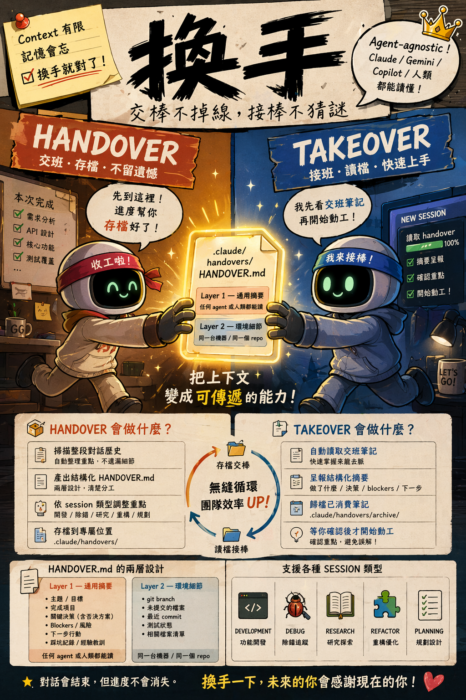
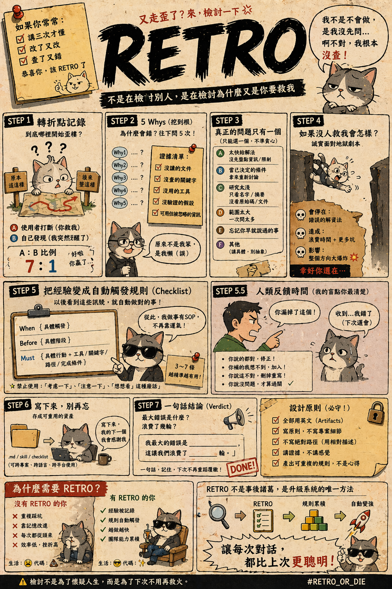

# samzhu-agent-skills

[繁體中文](README.zh-TW.md)

Development workflow and creative tools skills for Claude Code.

## Installation

Add the marketplace:

```bash
claude plugin marketplace add samzhu/agent-skills
```

Install individual plugins:

```bash
claude plugin install tdd@samzhu-agent-skills
claude plugin install bdd@samzhu-agent-skills
claude plugin install springboot-config-organizer@samzhu-agent-skills
claude plugin install research@samzhu-agent-skills
claude plugin install ui-craft@samzhu-agent-skills
claude plugin install depx@samzhu-agent-skills
claude plugin install handover@samzhu-agent-skills
claude plugin install takeover@samzhu-agent-skills
claude plugin install retro@samzhu-agent-skills
```

## Skills

| Skill | Description |
|-------|-------------|
| **tdd** | Test-Driven Development with strict Red-Green-Refactor cycle |
| **bdd** | Behavior-Driven Development: Discovery → Formulation → Automation |
| **springboot-config-organizer** | Spring Boot configuration dual-layer profile design organizer |
| **research** | Research development topics and produce structured tutorial documents |
| **ui-craft** | Intentional UI design with craft quality, not defaults |
| **depx** | Explore JVM dependency source code by indexing and decompiling JAR files |
| **handover** | Save session context as a structured note for any agent or human to resume |
| **takeover** | Read a handover note, archive it, and resume work seamlessly |
| **retro** | Evidence-based retrospective that produces a reusable trigger-action checklist |

## Usage

### TDD

Trigger words: `TDD`, `test first`, `test-driven`, `Red-Green-Refactor`

The skill enforces the strict Red-Green-Refactor cycle: write a failing test first, implement minimal code to pass, then refactor.

### BDD

Trigger words: `BDD`, `Gherkin`, `scenario`, `feature file`, `acceptance criteria`, `user story`, `Example Mapping`

Covers three phases: Discovery (explore requirements with examples), Formulation (write Gherkin scenarios), and Automation (outside-in development).

### Spring Boot Config Organizer

Trigger words: `Spring Boot config`, `application.yml`, `profile`

Organizes Spring Boot configuration files using a dual-layer profile design pattern.

### Research

Trigger words: `research`, `tutorial`

Researches development topics using web search and produces structured, bilingual tutorial documents.

### UI Craft

Trigger words: `UI`, `design system`, `craft`, `shadcn`

Guides intentional UI design decisions with craft quality — every visual choice should be deliberate.

### Depx (Dependency Explorer)

Trigger words: `dependency source`, `decompile`, `JAR`, `inspect class`, `library internals`

**Why this skill exists:** When using Claude Code with JVM projects, inspecting third-party dependency source code is a common need — checking class signatures, understanding library internals, or finding the right API to call. Without this skill, Claude Code resorts to repeated `find ~/.gradle/caches` and `javap` commands like:

```
JAR=$(find ~/.gradle/caches -name "some-lib-0.10.0.jar" 2>/dev/null | head -1) \
  && javap -p -classpath "$JAR" com.example.SomeClass
```

Each of these commands triggers a permission prompt ("Command contains `$()` command substitution — Do you want to proceed?"), turning a simple class lookup into a tedious approve-per-command workflow. For a single investigation you might need 5–10 approvals.

Depx solves this by building a local `.depx/` index once (manifest files searchable via Grep with no permission prompt), and decompiling JARs on demand. After the one-time setup, most lookups require **zero Bash commands and zero permission prompts**.

Indexes JVM dependency JARs and lets you search class signatures or decompile full source code on demand. Supports both Gradle and Maven projects.

### Handover & Takeover

<p align="center">
  
</p>

#### Handover

Trigger words: `handover`, `交班`, `換手`, `shift change`, `save progress`, `wrap up session`, `pass the baton`, `先到這裡`, `存檔`

Generates a structured `.claude/handovers/HANDOVER.md` with two layers: a portable summary (readable by any agent or human) and environment details (git state, key files). The note is designed to be agent-agnostic — Claude, Gemini, Copilot, or a human can all pick it up.

#### Takeover

Trigger words: `takeover`, `接班`, `pick up where we left off`, `resume handover`, `continue from last session`, `read handover`

Reads the handover note, presents a structured briefing (what was done, key decisions, blockers, action plan), archives the consumed note to `.claude/handovers/archive/`, and waits for confirmation before starting work.

### Retro

<p align="center">
  
</p>

Trigger words: `retro`, `retrospective`, `lessons learned`, `what went wrong`, `post-mortem`, `review this session`, `what could be improved`

Produces an evidence-grounded retrospective with a 7-step protocol: turning points ledger, 5 Whys with evidence, root cause selection, counterfactual analysis, trigger-action checklist, human feedback, and artifact persistence. The main deliverable is a reusable trigger-action checklist that auto-triggers in future sessions.

## Example

### `/springboot-config-organizer` — Organize Spring Boot Config

**Prompt:**

```
Use /springboot-config-organizer to organize the backend config files
```

**Output:**

The skill first analyzes issues in existing config files:

| Issue | Description |
|-------|-------------|
| Duplicate YAML keys | `application.yml` has two `aci:` blocks, the latter overrides the former |
| Single file too large | All configuration in one `application.yml` with no profile separation |
| No unified secret strategy | API keys scattered with `${ENV_VAR:}`, no secrets file management |
| Thin prod profile | `application-prod.yml` only overrides one system prompt |

Then suggests a new structure:

```
backend/
├── src/main/resources/                 (packaged into Docker Image)
│   ├── application.yaml                ← Base shared config
│   ├── application-local.yaml          ← Local infrastructure
│   └── application-gcp.yaml            ← GCP infrastructure
│
├── config/                             (external config, not packaged)
│   ├── application-dev.yaml            ← Dev environment (DEBUG logs, import secrets)
│   ├── application-prod.yaml           ← Production environment
│   └── application-secrets.properties.example  ← Secrets template
│
└── src/test/resources/
    └── application-test.yml            ← Unchanged
```

With unified property naming:

| Property | Purpose | Default |
|----------|---------|---------|
| `aci-oauth2-issuer-uri` | OIDC Provider Issuer URI | (empty) |

## License

MIT License — see [LICENSE](LICENSE) for details.
